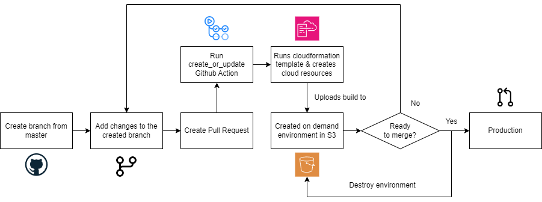

# On demand enviroments with AWS Cloudformation

```
A simple proof of concept to create on demand enviroments
```

Ever wondered how Vercel creates on demand staging environments on every branch? We are going to replicate that in this project using AWS Cloudformation and Github Actions. The same concept can be applied to any other cloud provider and CI/CD tool.

### TLDR:

1. A pull request is created or updated
2. The Github Action is triggered and creates a S3 bucket with the name of the branch and bucket policy to allow public access to the bucket
3. The Github Action uploads the build content file of the branch to the S3 bucket
4. The Github Action creates a comment on the pull request with the url of the S3 bucket
5. When the pull request is merged/closed the Github Action deletes the S3 bucket

### Not clear enough?

Here is a diagram of the process:

<div align="center">
   
</div>

### Steps

1. First we must create a cloudformation template. The template will accept 3 arguments the bucket name, envPrefix and github username.This is because we want to create the enviroment with the following name: `http://<branch-name>.<github.username>.com.s3-website-us-east-1.amazonaws.com`. In this template we are also specifying 2 logical resources: The AWS S3 bucket itself and a Bucket Access Policy.

```yaml
Parameters:
   # We pass the paramters
   BucketName: 
      Type: String 
      Description: Enter Bucket Name
   EnvPrefix:
      Type: String
   Username:
      Type: String
Resources:
   # We create a bucket
   MyBucket:
      Type: AWS::S3::Bucket
      Properties: 
         BucketName: !Ref BucketName
         WebsiteConfiguration: 
         IndexDocument: index.html
         PublicAccessBlockConfiguration:
         BlockPublicAcls: false
         BlockPublicPolicy: false
         IgnorePublicAcls: false
         RestrictPublicBuckets: false
   # We create a bucket policy
   MyBucketPolicy:
      Type: AWS::S3::BucketPolicy
      Properties:
         Bucket: !Ref MyBucket
         PolicyDocument:
         Version: 2012-10-17
         Statement:
            - Action:
               - 's3:GetObject'
               Effect: Allow
               Principal: '*'
               Resource: !Join
               - ''
               - - 'arn:aws:s3:::'
                  - !Ref EnvPrefix
                  - '.'
                  - !Ref Username
                  - '.com/*'
Outputs:
   WebsiteURL:
      Value: !GetAtt MyBucket.WebsiteURL
      Description: URL for website hosted on S3

```

2. When a pull request is created or updated we want to create a new enviroment. We can do this by using Github Actions. We will use the [aws-actions/aws-cloudformation-github-deploy](https://github.com/aws-actions/aws-cloudformation-github-deploy) as a base for our action. This action will create a new stack on AWS Cloudformation.

```yaml
on:
  pull_request:
    types: [reopened, opened, synchronize, edited]

name: Create S3 Environment
jobs:
  create_or_update_pr_env:
    runs-on: ubuntu-latest
    steps:
      - name: Checkout
        uses: actions/checkout@v1
      - name: Install Dependencies
        run: npm ci
      - name: Build Site
        run: npm run build
      - name: Deploy to AWS CloudFormation
        id: cfn-deploy
        uses: aws-actions/aws-cloudformation-github-deploy@v1
        with:
          name: ${{ env.BRANCH_NAME }}
          template: cloudformation/on-demand-environment.yml
          parameter-overrides: "EnvPrefix=${{ env.BRANCH_NAME }},BucketName=${{ env.BUCKET_NAME }},Username=${{ env.USERNAME }}"
          aws-region: ${{ env.AWS_REGION }}
          no-fail-on-empty-changeset: "1"
      - name: Deploy static site to S3 bucket
        run: aws s3 sync ./dist s3://${{ env.BRANCH_NAME }}.${{ env.USERNAME }}.com --delete
      - name: Comment website URL on GitHub issue
        run: node .github/actions/comment.js
        env:
          WEBSITE_LINK: ${{ steps.cfn-deploy.outputs.WebsiteURL }}
          ISSUE_NUMBER: ${{ github.event.pull_request.number }}
          REPO: ${{ github.event.repository.name }}
          OWNER: ${{ github.repository_owner }}
          GITHUB_TOKEN: ${{ secrets.GH_TOKEN }}
    env:
      AWS_ACCESS_KEY_ID: ${{ secrets.AWS_ACCESS_KEY_ID }}
      AWS_SECRET_ACCESS_KEY: ${{ secrets.AWS_SECRET_ACCESS_KEY }}
      AWS_REGION: ${{ secrets.AWS_REGION }}
      BUCKET_NAME: '${{ github.head_ref }}.${{ github.actor }}.com'
      BRANCH_NAME: ${{ github.head_ref }}
      USERNAME: ${{ github.actor }}
```

3. To be able to create a comment on the pull request we are going to use a node script. This script will use the [octokit/rest.js](https://octokit.github.io/rest.js/v20) library to create a comment on the pull request.

```javascript
import github from '@actions/github'

async function run() {
  const { ISSUE_NUMBER, GITHUB_TOKEN, OWNER, REPO, WEBSITE_LINK } = process.env

  const octokit = github.getOctokit(GITHUB_TOKEN)

  try {
    const { data } = await octokit.rest.issues.createComment({
      owner: OWNER,
      repo: REPO,
      issue_number: ISSUE_NUMBER,
      body: `[${WEBSITE_LINK}](${WEBSITE_LINK.replace(/"/gs, '')})`
    });
    console.log('created comment', data);
  } catch (err) {
    throw err
  }
}

run();
```

4. When the pull request is merged or closed we want to delete the enviroment. We can do this by using Github Actions. Here's the action:

```yaml
on:
  pull_request:
    types: [closed]

name: Destroy PR Env
jobs:
  destroy_pr_env:
    runs-on: ubuntu-latest
    steps:
      - name: Checkout
        uses: actions/checkout@v1
        with:
          ref: ${{ env.BRANCH_NAME }}
      - name: Configure AWS Credentials
        uses: aws-actions/configure-aws-credentials@v3
        with:
          aws-access-key-id: ${{ env.AWS_ACCESS_KEY_ID }}
          aws-secret-access-key: ${{ env.AWS_SECRET_ACCESS_KEY }}
          aws-region: ${{ env.AWS_REGION }}
      - name: Delete objects in S3
        run: |
          aws s3 rm s3://${{ env.BRANCH_NAME }}.${{ env.USERNAME }}.com --recursive
          aws cloudformation delete-stack --stack-name ${{ env.BRANCH_NAME }}
    env:
      AWS_ACCESS_KEY_ID: ${{ secrets.AWS_ACCESS_KEY_ID }}
      AWS_SECRET_ACCESS_KEY: ${{ secrets.AWS_SECRET_ACCESS_KEY }}
      AWS_REGION: ${{ secrets.AWS_REGION }}
      BRANCH_NAME: ${{ github.head_ref }}
      USERNAME: ${{ github.actor }}
```

### Demo Screenshots

Branch is created:

<div align="center">
   
</div>

Here are the changes:

<div align="center">
   
</div>

Pull request is created with the generated URL:

<div align="center">
   
</div>

Small vite app is deployed with the changes:

<div align="center">
   
</div>

Once merged the stack is deleted along with the S3 bucket:

<div align="center">
   
</div>